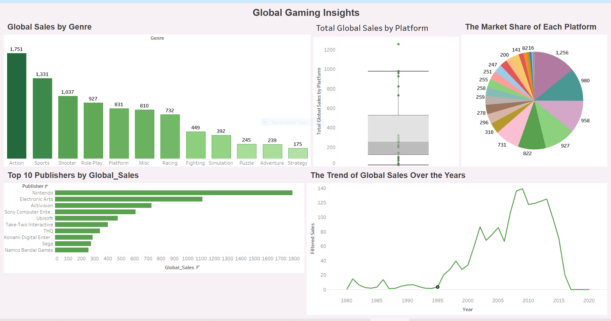
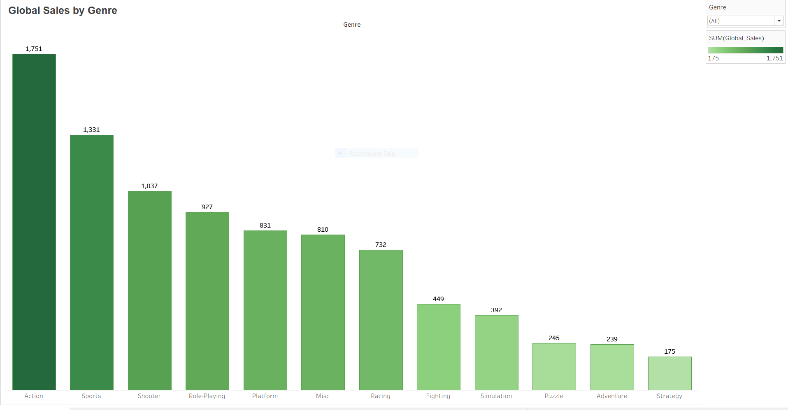
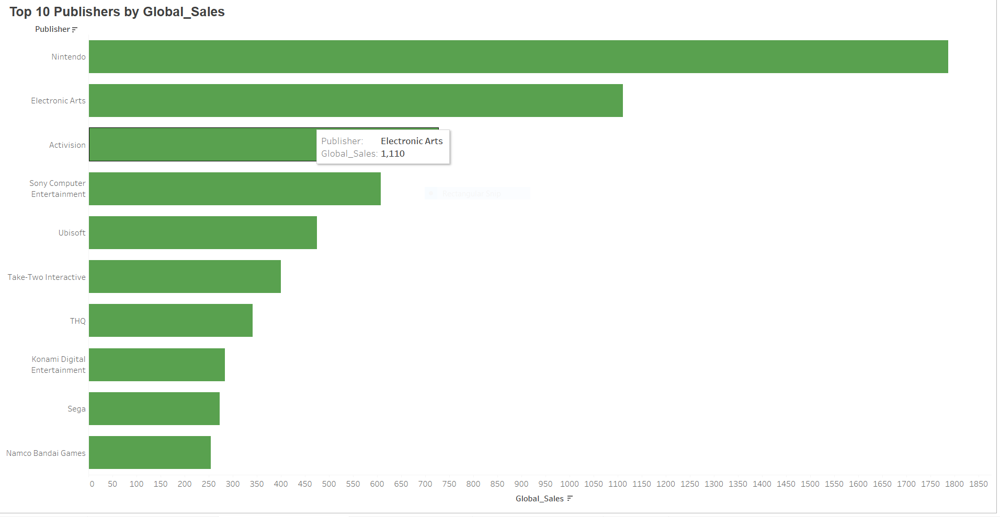
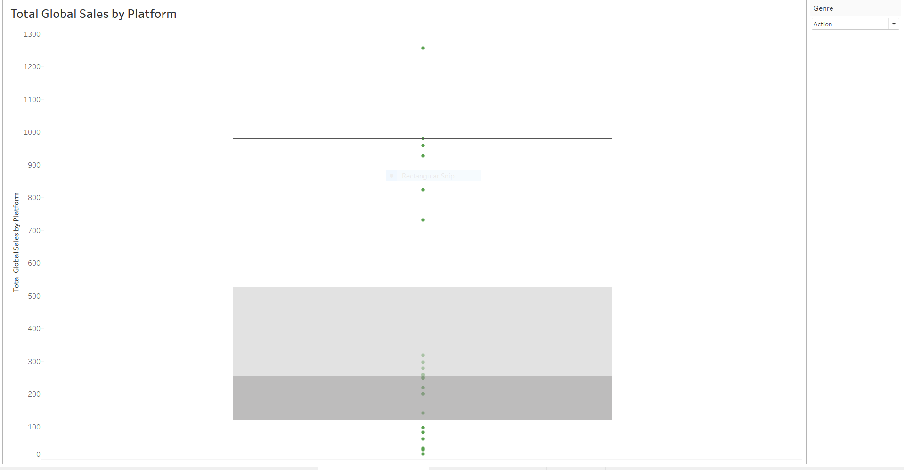
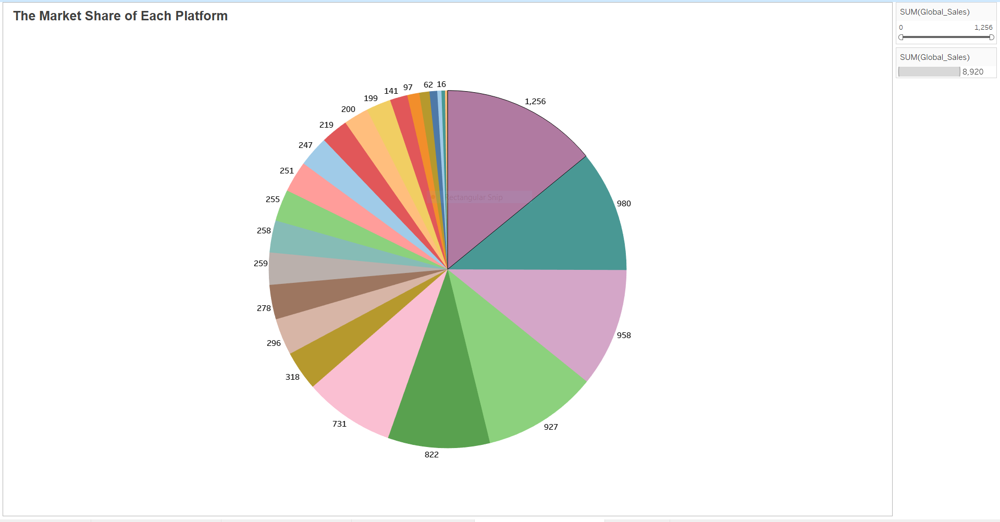
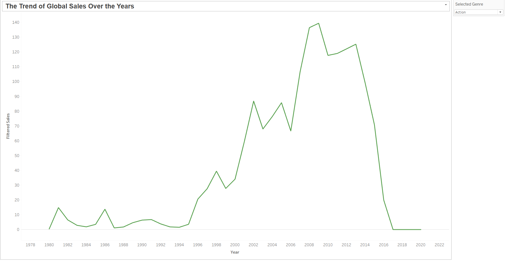

# Video Game Sales Analysis Dashboard (Tableau)

Interactive dashboard built in **Tableau** to analyze global video game sales, uncovering regional trends, genre popularity, and publisher adoption shifts.

---

## Dataset
- The dataset used is the **Video Game Sales Dataset (VGChartz, Kaggle)**.  
- See detailed [Data Dictionary](docs/data_dictionary.md) for field descriptions.  

---

## Demo

### Tableau Dashboard

**Screenshots**

  
  
  
  
  
  

---

## Highlights
- 📊 **Global Sales by Genre**: Action and Sports dominate worldwide, showing clear audience preferences.  
- 🏆 **Top Publishers**: Nintendo leads significantly, followed by Electronic Arts and Activision.  
- 🎮 **Platform Insights**: Market share distributed across PlayStation, Xbox, and Nintendo consoles.  
- 🌍 **Regional Trends**: Clear differences in adoption across NA, EU, and JP.  
- ⏳ **Trend Analysis**: Peak sales between 2005–2010 with a decline in recent years.  

---

## How to Use
- **Tableau**: Open the `.twbx` file in `/tableau/` to interact with dashboards.  
- **Docs**: Check `/docs/` for project overview and data dictionary.  
- **Images**: All dashboard screenshots stored in `/images/`.  

---

## Data Notes
- Data sourced from VGChartz and Kaggle.  
- Sales values are expressed in **millions of units sold**.  
- Global sales = sum of regional sales (NA, EU, JP, Other).  

---

## License
MIT (see `LICENSE`).

---

## Author
**Rutuja A. Bhatankar**  
MSc in Data Analytics | BI Enthusiast  
